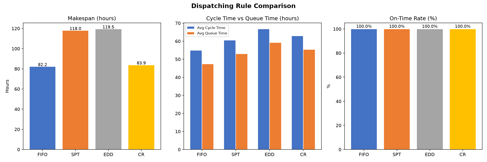
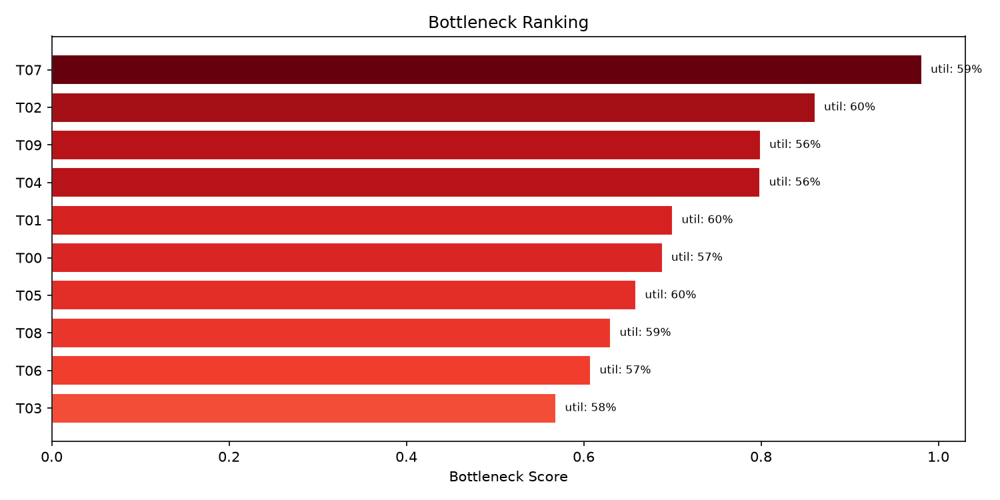
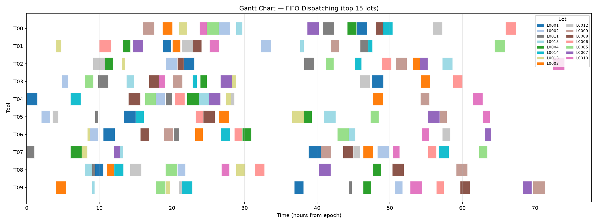
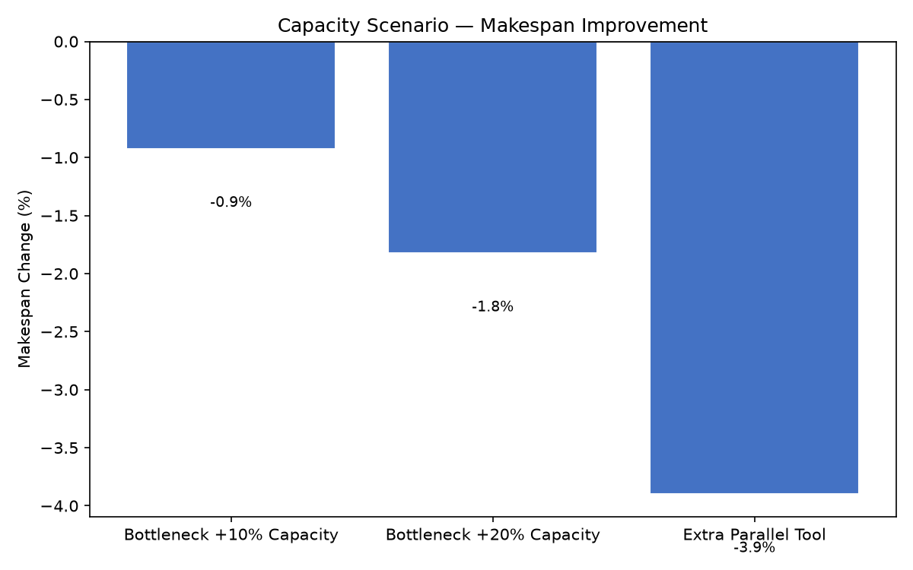

# Fab 产能仿真与派工优化

[**English**](README.md) | [**中文**](README_CN.md)

> 一个基于 Python 的类晶圆厂产能仿真模型，使用公开 Job Shop Scheduling 基准数据，对比 FIFO、SPT、EDD 和 Critical Ratio 等派工规则，评估 makespan、周期时间、排队时间、设备利用率、准时率，并开展瓶颈产能情景分析。

---

## 🚀 5 分钟快速浏览

本项目模拟晶圆批次在类晶圆厂环境中的加工过程，对比 4 种派工规则和 3 种产能扩展方案，找出降低周期时间和提升产出的最佳策略。

### 图表一览

| 派工规则对比 | 瓶颈排名 |
|------------|---------|
|  |  |

| FIFO 甘特图 | 产能改善瀑布图 |
|------------|--------------|
|  |  |

### 关键结果一览

| 指标 | 最优规则 | 数值 |
|------|---------|------|
| **Makespan** | FIFO | **82.25 h** |
| **平均周期时间** | FIFO | **54.89 h** |
| **排队时间占比** | FIFO | **85.9%** |
| **准时率** | 全部 | **100%** |
| **瓶颈设备** | — | T07（综合得分） |
| **最佳产能改善** | 增加并行设备 | 周期时间 −9.4% |

---

## 1. 业务背景

本项目模拟一个类晶圆厂生产系统：晶圆批次按照固定工艺路线，在多台设备之间依次加工。项目目标是比较不同派工规则和产能情景，帮助降低周期时间、提升准时交付能力，并识别关键瓶颈设备。

**业务假设：**

1. 每个 lot 必须按照固定路线加工。
2. 每道工序只能在指定 tool 上加工。
3. 每台 tool 同一时间只能加工一道工序。
4. lot 在进入 tool 前可能排队，并累积 queue time。
5. 暂不考虑设备故障、返工、批处理以及其他复杂 fab 规则，详见 Limitations。

## 2. 数据来源

- **基准数据仓库**：[Job Shop Scheduling Benchmark: Environments and Instances](https://github.com/ai-for-decision-making-tue/Job_Shop_Scheduling_Benchmark_Environments_and_Instances)
- **数据目录**：`data/raw/`
- **论文参考**：[Job Shop Scheduling Benchmark: Environments and Instances](https://arxiv.org/abs/2308.12794)
- **使用实例**：`abz5`、`abz6`、`abz7`、`abz8`、`abz9`

| 实例 | Jobs | Machines | Operations |
|------|------|----------|------------|
| abz5 | 10   | 10       | 100        |
| abz6 | 10   | 10       | 100        |
| abz7 | 20   | 15       | 300        |
| abz8 | 20   | 15       | 300        |
| abz9 | 20   | 15       | 300        |

> 本项目使用公开 job-shop scheduling benchmark 构建类 fab 产能仿真，并非基于真实 fab MES 数据。

## 3. 类 Fab 数据映射

| Benchmark 概念 | 类 Fab 场景 | 说明 |
|----------------|-------------|------|
| job | lot / wafer lot | 待加工的一批晶圆 |
| operation | process step | 晶圆路线中的一道工序 |
| machine | tool | 可执行加工的设备 |
| processing time | run time | 设备加工时长 |
| operation sequence | route sequence | 工艺路线顺序 |
| dispatching rule | lot dispatch policy | 等待 lot 的优先级规则 |
| makespan | total completion time | 所有 lot 完成所需总时间 |
| flow time | cycle time | 从 release 到 finish 的时间 |

## 4. 项目结构

```text
fab-capacity-simulation-python/
  README.md
  README_CN.md
  data/
    raw/                  # 原始 benchmark 实例，abz5-abz9
    processed/            # 解析后的 CSV 数据
  src/
    parser.py             # 将原始 JSP 数据解析为 operations.csv
    simulator.py          # 离散事件仿真引擎
    dispatch_rules.py     # FIFO、SPT、EDD、CR、LRPT 派工规则
    metrics.py            # KPI 计算与对比
    visualization.py      # 图表与可视化
  notebooks/
    01_data_exploration.ipynb
    02_dispatching_simulation.ipynb
    03_capacity_scenario_analysis.ipynb
  outputs/figures/        # 生成的图表
  docs/
    methodology.md
```

## 5. 快速开始

### 环境要求

- Python 3.8+
- pip

```bash
python -m pip install -r requirements.txt
```

### Step 1：解析 Benchmark 数据

```bash
python src/parser.py
```

该脚本会读取 `data/raw/` 中的原始实例，并生成 `data/processed/operations.csv`。

### Step 2：运行完整流程

```bash
python run_all.py
```

该命令会运行 4 种派工规则的基线仿真、3 个产能情景，生成全部图表，并保存输出 CSV 文件。

### 可复现性检查

运行完整流程：

```bash
python src/parser.py
python run_all.py
```

预期输出：

| 文件 | 预期行数 |
|------|---------:|
| `data/processed/operations.csv` | 1,100 |
| `data/processed/simulation_events.csv` | 4,400 |
| `data/processed/simulation_summary.csv` | 4 |
| `data/processed/scenario_summary.csv` | 16 |

`outputs/figures/` 中的图表文件：

- `gantt_fifo.png`、`gantt_cr.png`
- `rule_comparison.png`
- `utilization_heatmap_fifo.png`、`utilization_heatmap_cr.png`
- `bottleneck_ranking.png`
- `queue_distribution_fifo.png`、`queue_distribution_cr.png`
- `scenario_improvement_waterfall.png`

### Step 3：查看 Notebooks

```bash
jupyter notebook notebooks/
```

- `01_data_exploration.ipynb`：探索解析后的数据结构
- `02_dispatching_simulation.ipynb`：运行仿真、比较派工规则并生成图表
- `03_capacity_scenario_analysis.ipynb`：瓶颈产能情景分析

### 验证

运行可复现性检查，验证管道输出：

```bash
# unittest（Python 内置，无需额外依赖）
python -m unittest discover -s tests -v

# 或 pytest（如已安装）
python -m pytest tests -v
```

所有检查应全部通过：CSV 行数、图表文件存在性、FIFO KPI 阈值、源码语法。

## 6. 派工规则

| 规则 | 逻辑 | IE 解读 |
|------|------|---------|
| **FIFO** | 先到先服务，最早进入队列的 lot 优先 | 稳定、公平、易解释 |
| **SPT** | 最短加工时间优先 | 降低平均 flow time |
| **EDD** | 最早交期优先 | 提升准时交付能力 |
| **CR** | Critical Ratio = (due - now) / remaining work | 优先处理风险较高的 lot |
| **LRPT** | 最长剩余加工时间优先 | 可选规则，用于平衡负载 |

## 7. 性能指标

| 指标 | 说明 |
|------|------|
| makespan | 完成所有 lot 的总时间 |
| avg_cycle_time | 平均 lot 周期时间，即 release 到 finish |
| median_cycle_time | lot 周期时间中位数 |
| avg_queue_time | 每道工序的平均等待时间 |
| queue_time_ratio | 排队时间 / 总周期时间 |
| max_lateness | 超过交期的最大延迟时间 |
| on_time_rate | 在交期前或交期当天完成的 lot 比例 |
| avg_tool_utilization | 平均设备利用率 |
| bottleneck_tool | 瓶颈得分最高的设备 |
| bottleneck_utilization | 瓶颈设备利用率 |

## 8. 产能情景

| 情景 | 说明 |
|------|------|
| baseline | 原始设备产能 |
| bottleneck +10% | 瓶颈设备加工时间降低 10% |
| bottleneck +20% | 瓶颈设备加工时间降低 20% |
| extra parallel tool | 在瓶颈工站增加一台相同并行设备 |

## 9. 结果与发现

本项目分析了 5 个 benchmark 实例中的 80 个 lot 和 1,100 道工序。

### 基线规则对比（FIFO simulation）

| 规则 | Makespan | 平均周期时间 | 平均排队时间 | 排队占比 | 准时率 | 利用率 |
|------|----------|-------------|-------------|---------|-------|-------|
| FIFO | 82.25 h | 54.89 h | 47.36 h | 85.9% | 100.0% | 48.8% |
| SPT | 118.02 h | 60.54 h | 53.02 h | 86.6% | 100.0% | 34.0% |
| EDD | 119.52 h | 66.78 h | 59.26 h | 87.5% | 100.0% | 33.6% |
| CR | 83.87 h | 62.98 h | 55.46 h | 87.8% | 100.0% | 47.8% |

### 关键发现

- **FIFO 在当前 benchmark 配置下取得最低 makespan 和平均 cycle time**，在合成 release schedule 与 due-date 假设下优于 SPT 和 EDD。
- **CR 的 makespan 与 FIFO 接近**，为 83.87 h 对 82.25 h，但平均 cycle time 更高；当需要关注交期风险时，CR 是较好的替代规则。
- **SPT 和 EDD 在该实例集合中未优于 FIFO**。在固定路线 job shop 中，纯局部优先级决策可能导致下游拥堵。
- **所有规则均达到 100% 准时率**，因为合成交期约 14 天，相对实际周期时间约 3 到 5 天较宽松。

### 瓶颈与产能

- **综合瓶颈设备 T07** 在加权得分中排名最高，得分由 utilization 0.4、queue time 0.4、WIP 0.2 组成。
- **最高利用率设备 T01** 在 FIFO 下达到 60.5% 利用率。
- 相比只改变派工规则，瓶颈产能扩张能更有效地降低排队时间。
- 在瓶颈工站增加一台并行设备带来最大改善：FIFO 下 **cycle time 降低 9.4%，queue time 降低 10.9%**。

### 排队时间主导

- 在所有派工规则中，等待时间均贡献了 **85% 以上的平均 cycle time**。
- 由于 lot 批量 release 和共享设备资源竞争，早期工序累积了更多 queue time。

## 10. 建议

- 将 **FIFO** 作为基线派工规则，因为它在当前 benchmark 配置下获得最低 makespan 和平均 cycle time。
- 当交期压力变紧时，可使用 **CR** 作为具备紧急度感知的替代规则，其 makespan 与 FIFO 接近。
- 后续实验应收紧 **合成 due-date 假设**，以更好地区分 EDD 和 CR 的表现。
- 优先对 **综合瓶颈设备 T07** 投资产能，而不是先扩张非瓶颈设备。
- 将 **派工规则与产能规划结合**；在严重产能约束下，仅调整派工规则无法根本解决拥堵。

## 11. 局限性与下一步

- benchmark 数据不包含真实 fab 约束，例如批处理、返工、预防性维护、recipe qualification、tool dedication 或随机停机。
- due date 和 priority 来自配套 SQL data mart 项目的模拟设定。
- 本项目聚焦生产物流决策支持，而不是可直接部署的精确 fab scheduling 系统。

**潜在扩展方向：**

- 加入 setup-time optimization 和基于 family 的排程。
- 实现最优产能分配的线性规划模块，例如 `scipy.optimize.linprog` / `PuLP`。
- 扩展到 Flexible Job Shop Scheduling (FJSP) 实例。
- 构建 Streamlit 交互式 dashboard，用于 what-if 情景测试。

## 12. 简历描述

**English：**

> Developed a Python-based fab capacity simulation model using public job-shop scheduling benchmark data; compared FIFO, SPT, EDD, and Critical Ratio dispatching rules, evaluated makespan, cycle time, queue time, tool utilization, and on-time rate, and conducted bottleneck capacity scenario analysis.

**中文：**

> 基于公开 Job Shop Scheduling benchmark 构建类晶圆厂产能仿真模型，使用 Python 比较 FIFO、SPT、EDD、Critical Ratio 等派工规则，并从 makespan、周期时间、排队时间、设备利用率和准时率角度评估产能改善方案与瓶颈扩容情景。

## 13. 技术栈

| 层级 | 技术 |
|------|------|
| Simulation Engine | Python standard library + dataclasses |
| Data Processing | pandas, csv |
| Visualization | matplotlib |
| Notebooks | Jupyter |
| Version Control | Git |

## 14. 与 SQL Data Mart 项目的关系

本项目是 [Fab Production Logistics KPI Data Mart](https://github.com/zhangjug/SQL) SQL 项目的 **Python 仿真配套项目**：

| 项目 | 关注点 | 能力 |
|------|--------|------|
| SQL Data Mart | KPI 监控、dashboard、产能审计 | SQL、数据建模、dashboard |
| Python Simulation | 派工规则、产能情景、优化分析 | Python、仿真、IE 决策支持 |

两个项目共同展示：*"具备 SQL 制造 KPI 系统经验和 Python 类 fab 产能仿真能力的 Logistics Engineering 候选人。"*

## 许可证

本项目基于 MIT License 开源，详见 [LICENSE](LICENSE) 文件。
